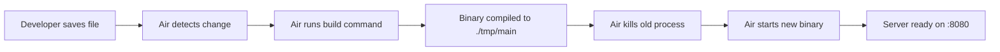

# Design Document: Air Hot-Reload Integration

## Overview

This feature integrates [Air](https://github.com/air-verse/air) as a development-time hot-reload tool for the Heidelberg tourism demo app. Air watches Go source files, HTML templates, and static assets for changes, then automatically rebuilds and restarts the server. The integration consists of:

1. A `.air.toml` configuration file at the project root
2. A `make dev` target to launch Air
3. Updated `.gitignore` to exclude Air's build artifacts
4. README documentation for the hot-reload workflow

This is a development-only concern with zero production impact. The `.air.toml` file and Makefile target are the only artifacts; no application code changes are required.

## Architecture

Air operates as an external process wrapper around the Go build/run cycle:



The architecture is simple: Air is a standalone binary that reads `.air.toml`, watches the configured directories, and manages the build/restart lifecycle. No code changes to the application are needed because Air wraps the existing build command externally.

### Directory Layout (new files only)

```
├── .air.toml          # Air configuration (new)
├── tmp/               # Air build output directory (gitignored, created at runtime)
│   └── main           # Compiled binary
├── Makefile           # Updated with `dev` target
├── .gitignore         # Updated with tmp/ entry
└── README.md          # Updated with hot-reload docs
```

## Components and Interfaces

### `.air.toml` Configuration

The Air configuration file defines:

| Section | Purpose |
|---------|---------|
| `[build]` | Build command, binary output path, watched extensions and directories, exclusions |
| `[log]` | Log formatting preferences |
| `[misc]` | Cleanup behavior on exit |

Key configuration values:

- **Build command**: `go build -o ./tmp/main ./cmd/server`
- **Binary path**: `./tmp/main`
- **Run command**: `./tmp/main` (no arguments needed; server reads PORT from env or defaults to 8080)
- **Watched extensions**: `.go`, `.html`, `.css`, `.js`
- **Watched directories**: root (`.`), which recursively covers `cmd/`, `internal/`, `templates/`, `static/`
- **Excluded directories**: `tmp`, `tests`, `node_modules`, `.git`, `vendor`

### Makefile `dev` Target

A simple phony target that invokes `air`:

```makefile
## dev: Start the application with hot-reload (requires Air)
dev:
	air
```

Air automatically discovers `.air.toml` in the current directory, so no flags are needed.

### `.gitignore` Update

Add a single line for the `tmp/` directory that Air uses for build output.

### README Update

A new "Development with Hot-Reload" section documenting:
- How to install Air
- How to run `make dev`
- What file types/directories are watched

## Data Models

No data model changes. This feature is purely development tooling configuration.

## Error Handling

| Scenario | Behavior |
|----------|----------|
| Air not installed | `make dev` fails with "air: command not found" — README documents installation |
| Build error in Go code | Air displays the compiler error in terminal, does not restart the old binary |
| Watched file deleted | Air triggers rebuild (standard Air behavior) |
| Port already in use | Server logs the error; developer must free the port (same as `make run`) |

Air's built-in error handling is sufficient. No custom error handling is needed.

## Testing Strategy

**Property-based testing does not apply to this feature.** The feature consists entirely of:
- A static TOML configuration file
- A Makefile target (one-line shell command)
- Documentation updates
- A `.gitignore` entry

There is no application logic, no data transformation, no function with inputs/outputs to test. The acceptance criteria are all verifiable by inspecting file contents.

**Verification approach:**
- **Manual verification**: Run `make dev`, edit a `.go` file, confirm the server restarts automatically
- **File content checks**: Verify `.air.toml` contains the correct paths, extensions, and exclusions
- **Smoke test**: Confirm `make dev` starts successfully and the server responds on `:8080`

No automated tests are added for this feature. The existing `make test` and `make test-visual` targets remain unchanged.
