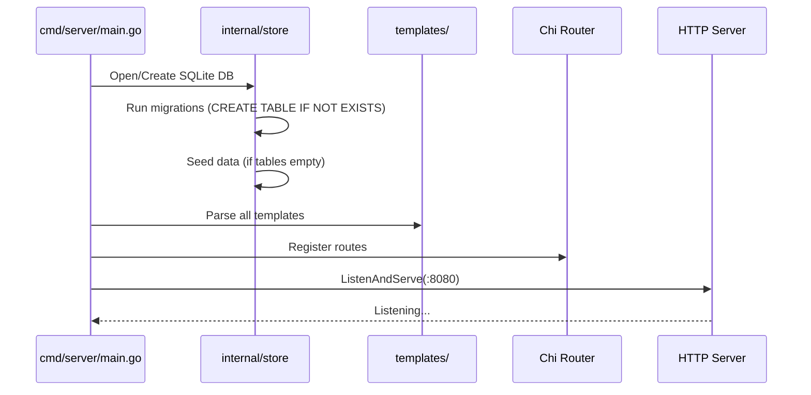

# Design Document: Basic App Infrastructure

## Overview

This design defines the foundational infrastructure for the Heidelberg Tourism Guide — a conference demo application built with Go, chi router, HTMX, Alpine.js, Tailwind CSS, and SQLite. The goal is a self-contained, visually compelling app that starts with `make run` and immediately displays real Heidelberg landmark content in German (default) or English.

The architecture follows a classic server-rendered MPA (multi-page application) pattern: Go renders HTML templates on the server, HTMX handles partial page updates (e.g., language switching), and Alpine.js manages lightweight client-side state (e.g., UI toggles). All assets are bundled locally — no CDN or external runtime dependencies.

### Key Design Decisions

| Decision | Choice | Rationale |
|----------|--------|-----------|
| SQLite driver | `modernc.org/sqlite` | Pure Go, no CGO required — simplifies cross-compilation and Docker builds |
| Router | `github.com/go-chi/chi/v5` | Lightweight, idiomatic, stdlib-compatible, URL params via `{id}` syntax |
| Logging | `log/slog` (standard library) | Structured logging built into Go 1.21+; no third-party dependency needed |
| Access logging | Custom chi middleware using `slog` | Keeps access logs and app logs in a single interleaved stream |
| i18n approach | Simple `map[string]map[string]string` for UI labels + DB translations for content | No heavy i18n library needed for 2 locales; keeps dependencies minimal |
| Language persistence | Cookie (`lang=de` or `lang=en`) | Simplest session-scoped persistence; no server-side session store needed |
| Template strategy | Shared base layout + page-specific templates | Standard Go `html/template` composition with `{{template}}` and `{{block}}` |
| Static assets | Downloaded via `make deps`, served via `http.FileServer` | Self-contained, no build-time CDN fetches |

## Architecture

```mermaid
graph TD
    subgraph Client
        Browser[Browser]
    end

    subgraph "Go Application (cmd/server)"
        Router[Chi Router]
        Handlers[Handlers]
        Templates[Template Engine]
        StaticFS[Static File Server]
        I18n[i18n Labels]
    end

    subgraph "Persistence"
        SQLite[(SQLite DB)]
    end

    subgraph "Static Assets (static/)"
        JS[htmx.min.js, alpine.min.js]
        CSS[tailwind.css]
        IMG[Landmark Images]
    end

    Browser -->|HTTP Request| Router
    Router -->|/| Handlers
    Router -->|/landmarks/{id}| Handlers
    Router -->|/static/*| StaticFS
    Handlers --> Templates
    Handlers --> SQLite
    Templates --> I18n
    StaticFS --> JS
    StaticFS --> CSS
    StaticFS --> IMG
```

### Request Flow

1. Browser sends HTTP request
2. Chi router dispatches to the appropriate handler (landing page, detail page, or static file server)
3. Handler reads locale from cookie (defaults to `"de"`)
4. Handler queries SQLite store for landmark data in the selected locale
5. Handler passes data + UI labels to the template engine
6. Template engine renders HTML with locale-appropriate content
7. Response sent to browser with all asset references pointing to `/static/...`

### Startup Sequence



## Components and Interfaces

### Package Structure

```
├── cmd/
│   └── server/
│       └── main.go              # Entry point: wires dependencies, starts server
├── internal/
│   ├── handler/
│   │   ├── handler.go           # Handler struct + constructor (holds store, templates, i18n)
│   │   ├── landing.go           # GET / — landing page
│   │   ├── detail.go            # GET /landmarks/{id} — detail page
│   │   └── language.go          # POST /language — switch language (sets cookie)
│   ├── model/
│   │   └── landmark.go          # Landmark and LandmarkTranslation structs
│   ├── store/
│   │   ├── store.go             # Store struct, Open(), Close()
│   │   ├── migrations.go        # Schema creation (CREATE TABLE IF NOT EXISTS)
│   │   ├── seed.go              # Seed data insertion
│   │   └── landmarks.go         # Query methods: ListLandmarks, GetLandmark
│   └── i18n/
│       └── i18n.go              # UI label translations (map-based)
├── templates/
│   ├── base.html                # Shared layout (head, nav, footer)
│   ├── landing.html             # Landing page content block
│   ├── detail.html              # Detail page content block
│   └── 404.html                 # Not found page
├── static/
│   ├── js/
│   │   ├── htmx.min.js
│   │   └── alpine.min.js
│   ├── css/
│   │   └── tailwind.css         # Pre-built Tailwind CSS (standalone CLI output)
│   └── img/
│       └── landmarks/           # Landmark images
├── Makefile
├── Dockerfile
├── go.mod
└── go.sum
```

### Key Interfaces

```go
// internal/store/store.go
type Store struct {
    db *sql.DB
}

func Open(dbPath string) (*Store, error)
func (s *Store) Close() error
func (s *Store) Migrate() error
func (s *Store) Seed() error
func (s *Store) ListLandmarks(locale string) ([]model.LandmarkWithTranslation, error)
func (s *Store) GetLandmark(id int64, locale string) (*model.LandmarkWithTranslation, error)
```

```go
// internal/handler/handler.go
type Handler struct {
    store     *store.Store
    templates *template.Template
    labels    map[string]map[string]string  // locale -> key -> label
}

func New(store *store.Store, tmpl *template.Template, labels map[string]map[string]string) *Handler
func (h *Handler) Landing(w http.ResponseWriter, r *http.Request)
func (h *Handler) Detail(w http.ResponseWriter, r *http.Request)
func (h *Handler) SwitchLanguage(w http.ResponseWriter, r *http.Request)
```

```go
// internal/i18n/i18n.go
func Labels() map[string]map[string]string
```

### Routing Table

| Method | Path | Handler | Description |
|--------|------|---------|-------------|
| GET | `/` | `Handler.Landing` | Landing page with landmark cards |
| GET | `/landmarks/{id}` | `Handler.Detail` | Landmark detail page |
| POST | `/language` | `Handler.SwitchLanguage` | Set language cookie, redirect back |
| GET | `/static/*` | `http.FileServer` | Serve static assets |

### Language Switching Mechanism

The language switcher uses a simple form POST to `/language` with the desired locale. The handler sets a `lang` cookie and redirects back to the referring page. This approach:
- Works without JavaScript (progressive enhancement)
- Can be enhanced with HTMX for a smoother experience (swap page content without full reload)
- Persists for the browser session via cookie

```go
// Cookie structure
http.Cookie{
    Name:     "lang",
    Value:    "de" | "en",
    Path:     "/",
    HttpOnly: true,
    SameSite: http.SameSiteLaxMode,
}
```

## Data Models

### Domain Structs

```go
// internal/model/landmark.go

// Landmark represents a point of interest in Heidelberg.
type Landmark struct {
    ID            int64
    Latitude      float64
    Longitude     float64
    ImageFilename string
    YearBuilt     int
    YearDestroyed *int  // nullable — nil means still standing
}

// LandmarkTranslation holds locale-specific content for a landmark.
type LandmarkTranslation struct {
    ID         int64
    LandmarkID int64
    Locale     string
    Name       string
    Description string
    History    string
}

// LandmarkWithTranslation is the joined view used by handlers.
type LandmarkWithTranslation struct {
    Landmark
    LandmarkTranslation
}
```

### SQLite Schema

```sql
CREATE TABLE IF NOT EXISTS landmarks (
    id              INTEGER PRIMARY KEY AUTOINCREMENT,
    latitude        REAL NOT NULL,
    longitude       REAL NOT NULL,
    image_filename  TEXT NOT NULL,
    year_built      INTEGER NOT NULL,
    year_destroyed  INTEGER  -- nullable
);

CREATE TABLE IF NOT EXISTS landmark_translations (
    id          INTEGER PRIMARY KEY AUTOINCREMENT,
    landmark_id INTEGER NOT NULL,
    locale      TEXT NOT NULL,
    name        TEXT NOT NULL,
    description TEXT NOT NULL,
    history     TEXT NOT NULL,
    FOREIGN KEY (landmark_id) REFERENCES landmarks(id),
    UNIQUE(landmark_id, locale)
);
```

### Seed Data

The app ships with 8 real Heidelberg landmarks. Seed data is inserted only when the `landmarks` table is empty (checked via `SELECT COUNT(*) FROM landmarks`).

| # | Landmark | Lat | Lon | Year Built | Year Destroyed | Image |
|---|----------|-----|-----|------------|----------------|-------|
| 1 | Heidelberger Schloss | 49.4105 | 8.7153 | 1214 | 1693 | `castle.jpg` |
| 2 | Alte Brücke (Karl-Theodor-Brücke) | 49.4133 | 8.7105 | 1788 | — | `old_bridge.jpg` |
| 3 | Philosophenweg | 49.4167 | 8.7000 | 1817 | — | `philosophers_walk.jpg` |
| 4 | Heiliggeistkirche | 49.4118 | 8.7063 | 1398 | — | `holy_spirit_church.jpg` |
| 5 | Studentenkarzer | 49.4107 | 8.7068 | 1778 | — | `student_prison.jpg` |
| 6 | Universitätsbibliothek | 49.4098 | 8.7060 | 1905 | — | `university_library.jpg` |
| 7 | Königstuhl | 49.3990 | 8.7280 | — | — | `koenigstuhl.jpg` |
| 8 | Neckarwiese | 49.4150 | 8.6950 | — | — | `neckar_meadow.jpg` |

Each landmark has translations in `"de"` and `"en"` with factually accurate name, description (1-2 sentences), and history text (2-3 sentences with real dates and events).

### UI Labels (i18n)

A simple Go map provides UI chrome translations:

```go
var labels = map[string]map[string]string{
    "de": {
        "app_title":    "Heidelberg Guide",
        "nav_home":     "Startseite",
        "back":         "Zurück",
        "year_built":   "Erbaut",
        "year_destroyed": "Zerstört",
        "language":     "Sprache",
        "description":  "Beschreibung",
        "history":      "Geschichte",
    },
    "en": {
        "app_title":    "Heidelberg Guide",
        "nav_home":     "Home",
        "back":         "Back",
        "year_built":   "Built",
        "year_destroyed": "Destroyed",
        "language":     "Language",
        "description":  "Description",
        "history":      "History",
    },
}
```

### Makefile Targets

| Target | Command | Description |
|--------|---------|-------------|
| `run` | `go run ./cmd/server` | Compile and start the app |
| `build` | `go build -o bin/server ./cmd/server` | Build binary to `bin/` |
| `test` | `go test ./...` | Run all unit tests |
| `lint` | `golangci-lint run` | Run linters |
| `deps` | `curl` commands | Download HTMX, Alpine.js, Tailwind CSS to `static/` |
| `clean` | `rm -rf bin/ heidelberg.db` | Remove build artifacts |
| `docker` | `docker build -t heidelberg-guide .` | Build Docker image |

### Dockerfile (Multi-Stage)

```dockerfile
# Stage 1: Build
FROM golang:1.23-alpine AS builder
WORKDIR /app
COPY go.mod go.sum ./
RUN go mod download
COPY . .
RUN go build -o server ./cmd/server

# Stage 2: Runtime
FROM alpine:3.19
RUN apk add --no-cache ca-certificates
WORKDIR /app
COPY --from=builder /app/server .
COPY --from=builder /app/templates ./templates
COPY --from=builder /app/static ./static
EXPOSE 8080
CMD ["./server"]
```

The SQLite database is created at runtime on first start (with automatic migration and seeding), so it does not need to be baked into the image. The container stores the DB file at `/app/heidelberg.db`.

### Template Composition

Templates use Go's `html/template` with a base layout pattern:

```
base.html          — defines <html>, <head>, <body>, includes nav + footer
  └── {{block "content" .}}  — page-specific content
landing.html       — defines "content" block with landmark card grid
detail.html        — defines "content" block with full landmark info
404.html           — defines "content" block with error message
```

Template data struct passed to rendering:

```go
type PageData struct {
    Labels   map[string]string          // UI labels for current locale
    Locale   string                     // "de" or "en"
    // Page-specific fields:
    Landmarks []model.LandmarkWithTranslation  // landing page
    Landmark  *model.LandmarkWithTranslation   // detail page
}
```

## Correctness Properties

*A property is a characteristic or behavior that should hold true across all valid executions of a system — essentially, a formal statement about what the system should do. Properties serve as the bridge between human-readable specifications and machine-verifiable correctness guarantees.*

### Property 1: Unique constraint on (landmark_id, locale) rejects duplicates

*For any* landmark_id and locale pair that already exists in the `landmark_translations` table, attempting to insert a second row with the same (landmark_id, locale) combination SHALL result in a constraint violation error.

**Validates: Requirements 5.5**

### Property 2: Seed data completeness

*For any* landmark in the seeded database, the landmark SHALL have non-null/non-zero values for latitude, longitude, year_built, and image_filename, AND there SHALL exist exactly two translation rows (one for "de" and one for "en") each with non-empty name, description, and history fields.

**Validates: Requirements 6.3, 6.4**

### Property 3: Locale-correct query results

*For any* landmark in the database and any locale in {"de", "en"}, querying `GetLandmark(id, locale)` SHALL return a result where the translation's locale field matches the requested locale.

**Validates: Requirements 6a.3**

### Property 4: UI labels completeness

*For any* locale in {"de", "en"} and any label key in the defined label set, the i18n labels map SHALL return a non-empty string value.

**Validates: Requirements 6a.6**

### Property 5: Landing page renders all landmarks

*For any* landmark present in the database, the rendered landing page HTML SHALL contain the landmark's translated name, a substring of its description, and an `` tag referencing its image filename.

**Validates: Requirements 10.2**

### Property 6: No external network dependencies in rendered pages

*For any* rendered page (landing or detail), all `src` and `href` attributes in `<script>`, `<link>`, and `` tags SHALL reference local paths (starting with `/static/` or `/`) and SHALL NOT reference external domains (http:// or https:// to third-party hosts).

**Validates: Requirements 10.7**

### Property 7: Detail page renders all landmark fields

*For any* landmark in the database, the rendered detail page at `/landmarks/{id}` SHALL contain the landmark's translated name, description, history text, year_built value, and an `` tag referencing its image filename.

**Validates: Requirements 11.2**

## Error Handling

### Logging Architecture

The application uses Go's standard `log/slog` package for all logging. A single `slog.Logger` instance is created at startup and used throughout the application.

#### Logger Setup

```go
// cmd/server/main.go
logger := slog.New(slog.NewTextHandler(os.Stdout, &slog.HandlerOptions{
    Level: slog.LevelInfo,
}))
slog.SetDefault(logger)
```

#### Access Log Middleware

A custom chi middleware logs every HTTP request at INFO level with structured fields:

```go
// internal/middleware/logging.go
package middleware

func RequestLogger(next http.Handler) http.Handler {
    return http.HandlerFunc(func(w http.ResponseWriter, r *http.Request) {
        start := time.Now()
        ww := NewResponseWriter(w) // wraps to capture status code
        next.ServeHTTP(ww, r)
        slog.Info("request",
            "method", r.Method,
            "path", r.URL.Path,
            "status", ww.Status(),
            "duration", time.Since(start).String(),
        )
    })
}
```

#### Log Output Format

All logs go to stdout in slog's text format:

```
time=2024-01-15T10:30:00.000Z level=INFO msg="database opened" path=heidelberg.db
time=2024-01-15T10:30:00.001Z level=INFO msg="migrations complete"
time=2024-01-15T10:30:00.050Z level=INFO msg="seed data inserted" landmarks=8
time=2024-01-15T10:30:00.051Z level=INFO msg="server listening" addr=:8080
time=2024-01-15T10:30:01.123Z level=INFO msg=request method=GET path=/ status=200 duration=12.3ms
time=2024-01-15T10:30:01.456Z level=INFO msg=request method=GET path=/static/css/tailwind.min.css status=200 duration=1.2ms
```

#### Package Structure Addition

```
├── internal/
│   ├── middleware/
│   │   └── logging.go           # Request logging middleware
```

### Startup Errors

| Error Condition | Behavior |
|----------------|----------|
| SQLite DB cannot be opened/created | Log descriptive error, exit with non-zero code |
| Template parsing fails | Log file name + parse error, exit with non-zero code |
| Port already in use | Log error from `ListenAndServe`, exit with non-zero code |

### Runtime Errors

| Error Condition | HTTP Response |
|----------------|---------------|
| Landmark ID not found | 404 with user-friendly error page (rendered via `404.html` template) |
| Invalid landmark ID format (non-integer) | 404 with error page |
| Static file not found | 404 (default `http.FileServer` behavior) |
| Undefined route | 404 (chi default) |
| Database query error | 500 Internal Server Error with generic error page |

### Error Design Principles

- **Fail fast on startup**: If the app cannot initialize correctly (DB, templates), it exits immediately with a clear message rather than running in a degraded state.
- **Graceful runtime errors**: User-facing errors render a styled error page, not raw stack traces.
- **No panics in handlers**: All handler errors are caught and converted to appropriate HTTP responses.

## Testing Strategy

### Unit Tests (Go `testing` package)

Focus areas:
- **Store layer**: Test `Migrate()`, `Seed()`, `ListLandmarks()`, `GetLandmark()` with an in-memory SQLite database
- **Handler layer**: Test handlers using `httptest.NewRecorder()` with a seeded test database
- **i18n**: Test label completeness and correct locale selection
- **Template rendering**: Test that templates parse without error and produce expected HTML fragments

Run via: `make test` → `go test ./...`

### Property-Based Tests (using `pgregory.net/rapid`)

The `rapid` library is chosen for property-based testing in Go — it's well-maintained, has a clean API, and integrates naturally with Go's `testing` package.

Configuration:
- Minimum 100 iterations per property test
- Each test tagged with a comment referencing the design property
- Tag format: **Feature: basic-app-infrastructure, Property {number}: {property_text}**

Property tests cover:
- **Property 1**: Generate random (landmark_id, locale) pairs, insert, then attempt duplicate insertion
- **Property 2**: After seeding, iterate all landmarks and verify field completeness
- **Property 3**: Generate random locale selections, query landmarks, verify locale match
- **Property 4**: Generate random locale + key combinations from the defined set, verify non-empty result
- **Property 5**: After seeding, render landing page, verify all landmarks appear
- **Property 6**: Render pages, parse HTML, verify no external URLs
- **Property 7**: For each landmark, render detail page, verify all fields present

### Visual Regression Tests (Playwright)

Focus areas:
- Landing page renders correctly at desktop (1280px) and mobile (375px) widths
- Detail page layout is consistent
- Language switching updates visible content

Run via: `make test-visual`

### What We Don't Test

- Dockerfile correctness (verified manually via `make docker` + `docker run`)
- Makefile target correctness (verified by CI pipeline or manual execution)
- Visual aesthetics (subjective, covered by Playwright screenshots for regression only)
- External network isolation (verified by Property 6 at the HTML level)

