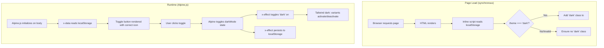
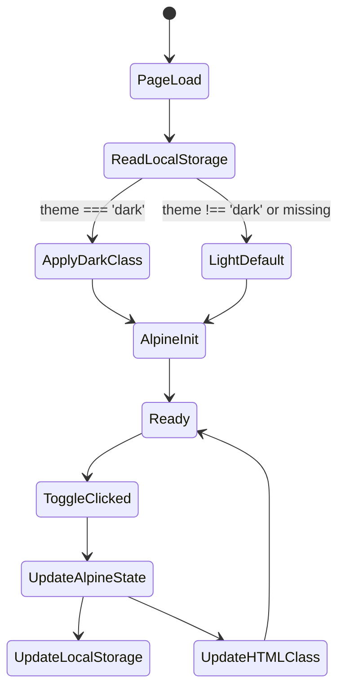

# Design Document: Dark Mode

## Overview

This design adds a toggleable dark color scheme to the HeidelGuide app. The implementation uses Tailwind CSS class-based dark mode (`darkMode: 'class'`), Alpine.js for client-side toggle state, and localStorage for persistence. A synchronous inline script in `<head>` prevents flash of unstyled content (FOUC) on page load.

The approach is entirely client-side — no Go backend changes are needed. All work happens in the templates and the Tailwind CDN configuration script.

### Key Design Decisions

1. **Class-based strategy over media query**: Allows explicit user control independent of OS preference, and is simpler to implement with Alpine.js state management.
2. **Inline head script for FOUC prevention**: Must execute synchronously before the browser paints, so it cannot be deferred or placed in an external file.
3. **Alpine.js `x-data` on `<body>`**: Provides reactive state that the toggle button and class binding can share without additional wiring.
4. **Tailwind `dark:` variants**: All styling changes are expressed as utility classes — no custom CSS needed beyond the transition utility.

## Architecture



### Execution Order

1. **Synchronous inline script** (in `<head>`, before Tailwind/Alpine load): Reads `localStorage.getItem('theme')`, applies `dark` class to `<html>` if value is exactly `'dark'`. This prevents FOUC.
2. **Tailwind CDN script** loads and processes `dark:` variants based on the class already present.
3. **Alpine.js** initializes (deferred), picks up the current state from localStorage, and makes the toggle reactive.

## Components and Interfaces

### 1. Tailwind CDN Configuration (`static/js/tailwind-cdn.js` usage in `base.html`)

The Tailwind CDN script supports runtime configuration via a `<script>` tag with `type="text/tailwindcss"` or by setting `tailwind.config` before the CDN script loads. Since the CDN script is served locally as `tailwind-cdn.js`, we add a configuration script block **before** loading it:

```html
<script>
  window.tailwind = window.tailwind || {};
  window.tailwind.config = {
    darkMode: 'class'
  };
</script>
<script src="/static/js/tailwind-cdn.js"></script>
```

This tells Tailwind to activate `dark:` variants when the `dark` class is on any ancestor element (we use `<html>`).

### 2. FOUC Prevention Script (inline in `<head>`)

Placed immediately after `<meta>` tags, before any stylesheets or scripts:

```html
<script>
  (function() {
    var theme = localStorage.getItem('theme');
    if (theme === 'dark') {
      document.documentElement.classList.add('dark');
    }
  })();
</script>
```

**Design rationale**: This is an IIFE that runs synchronously. It only adds the class — it never removes it (the default is light/no class). Invalid or missing values result in no class being added, which is the light mode default.

### 3. Alpine.js Theme Component (on `<body>`)

The `<body>` element becomes the Alpine.js component root for theme state:

```html
<body x-data="{ darkMode: localStorage.getItem('theme') === 'dark' }"
      x-effect="localStorage.setItem('theme', darkMode ? 'dark' : 'light'); document.documentElement.classList.toggle('dark', darkMode)"
      class="bg-stone-50 text-stone-800 min-h-screen flex flex-col transition-colors duration-200 ease-in-out">
```

**Key behaviors**:
- `x-data`: Initializes `darkMode` boolean from localStorage
- `x-effect`: Runs once on init AND re-runs whenever `darkMode` changes — persists to localStorage and toggles the `dark` class on `<html>`. This is preferred over `x-init` + `$watch` because `$watch` has known timing issues on the `<body>` element in Alpine.js 3.x.
- The `transition-colors duration-200 ease-in-out` class on body provides the smooth animation

**Why `x-effect` over `x-init` + `$watch`**: Alpine's `$watch` registered inside `x-init` on the `<body>` element does not reliably fire on state changes in Alpine.js 3.x. `x-effect` automatically tracks reactive dependencies and re-executes when they change, making it the correct primitive for this use case.

### 4. Toggle Button Component (in navigation)

```html
<button @click="darkMode = !darkMode"
        :aria-label="darkMode ? 'Switch to light mode' : 'Switch to dark mode'"
        role="button"
        class="px-2 py-1 rounded bg-emerald-800 hover:bg-emerald-700 transition-colors">
  <!-- Moon icon (shown in light mode) -->
  <svg x-show="!darkMode" xmlns="http://www.w3.org/2000/svg" class="h-4 w-4 text-amber-200" fill="none" viewBox="0 0 24 24" stroke="currentColor" stroke-width="2">
    <path stroke-linecap="round" stroke-linejoin="round" d="M20.354 15.354A9 9 0 018.646 3.646 9.003 9.003 0 0012 21a9.003 9.003 0 008.354-5.646z" />
  </svg>
  <!-- Sun icon (shown in dark mode) -->
  <svg x-show="darkMode" xmlns="http://www.w3.org/2000/svg" class="h-4 w-4 text-amber-200" fill="none" viewBox="0 0 24 24" stroke="currentColor" stroke-width="2">
    <path stroke-linecap="round" stroke-linejoin="round" d="M12 3v1m0 16v1m9-9h-1M4 12H3m15.364 6.364l-.707-.707M6.343 6.343l-.707-.707m12.728 0l-.707.707M6.343 17.657l-.707.707M16 12a4 4 0 11-8 0 4 4 0 018 0z" />
  </svg>
</button>
```

**Accessibility**: `aria-label` dynamically reflects the action, `role="button"` is explicit, and native `<button>` element provides keyboard operability (Enter/Space) for free.

## Data Models

This feature has no server-side data model changes. All state is client-side:

| Storage | Key | Values | Default |
|---------|-----|--------|---------|
| localStorage | `theme` | `'dark'` \| `'light'` | `'light'` (implicit — absence means light) |
| Alpine.js state | `darkMode` | `true` \| `false` | `false` |
| HTML element | `class` | includes `'dark'` or not | no `dark` class |

### State Synchronization



## Error Handling

| Scenario | Behavior |
|----------|----------|
| localStorage unavailable (private browsing, disabled) | Inline script silently fails (try/catch not needed — `getItem` returns `null`). Alpine.js defaults to `false` (light mode). Toggle still works for the session but won't persist. |
| Invalid localStorage value (e.g., `'Dark'`, `'night'`, `''`) | Inline script: `theme === 'dark'` is `false`, so no class added → light mode. Alpine.js: `localStorage.getItem('theme') === 'dark'` is `false` → light mode. |
| JavaScript disabled | No toggle rendered (Alpine.js won't initialize). Page stays in light mode. No broken layout. |
| Tailwind CDN script fails to load | Dark utility classes won't be generated. Page renders in light mode with base styles intact. |

## Testing Strategy

### Why Property-Based Testing Does Not Apply

This feature consists entirely of:
- **UI rendering** (Tailwind dark: variant classes on HTML elements)
- **Trivial client-side state** (a boolean toggle with only 2 possible values: dark/light)
- **CSS transitions** (animation timing)
- **localStorage read/write** (deterministic, 2-value domain)

There are no pure functions with meaningful input variation, no data transformations, no algorithms, and no serialization logic. The input space is effectively `{dark, light}` — running 100 iterations adds zero value over 2 example-based tests. PBT is not appropriate here.

### Recommended Testing Approach

**Visual Regression Tests (Playwright)** — primary strategy:
- Capture screenshots of each page (landing, detail, 404) in both light and dark mode
- Detect unintended visual regressions when styles change
- Run via `make test-visual`

**Example-Based Functional Tests (Playwright)**:
- Toggle button exists and is keyboard-accessible
- Clicking toggle switches the theme (dark class appears/disappears on `<html>`)
- localStorage is written on toggle
- Page loads with correct theme when localStorage is pre-set
- Invalid localStorage values default to light mode
- FOUC prevention: dark class is present before Alpine.js initializes (verify via inline script execution order)

**Unit Tests (Go)** — not applicable:
- No server-side logic changes for this feature. All behavior is client-side.

### Test Organization

```
tests/
├── visual.spec.ts          # Existing visual regression tests (extend with dark mode screenshots)
└── dark-mode.spec.ts       # New: functional tests for toggle behavior and persistence
```

### Key Test Scenarios

| Test | Type | What it verifies |
|------|------|-----------------|
| Landing page dark screenshot | Visual regression | Req 5 styling |
| Detail page dark screenshot | Visual regression | Req 6 styling |
| 404 page dark screenshot | Visual regression | Req 7 styling |
| Toggle switches theme | Functional | Req 2.2, 2.3, 2.4 |
| Correct icon displayed | Functional | Req 2.5 |
| localStorage persists choice | Functional | Req 3.1 |
| Page loads with stored preference | Functional | Req 3.2 |
| Default to light when no preference | Functional | Req 3.3 |
| Invalid localStorage defaults to light | Functional | Req 3.4 |
| Transition animation present | Functional | Req 8.1, 8.3 |
| Accessibility (aria-label, keyboard) | Functional | Req 2.7 |

### Template Changes Summary

All dark mode styling is applied via Tailwind `dark:` variant classes added to existing elements. No structural HTML changes are needed beyond:

1. **`base.html`**: Add FOUC script, Tailwind config script, Alpine.js `x-data`/`x-effect` on body, toggle button in nav, transition class on body, dark variants on nav/footer/body
2. **`landing.html`**: Add `dark:` variant classes to cards, hero overlay, text elements
3. **`detail.html`**: Add `dark:` variant classes to headings, body text, badges, breadcrumbs, borders
4. **`404.html`**: Add `dark:` variant classes to heading, description, background
