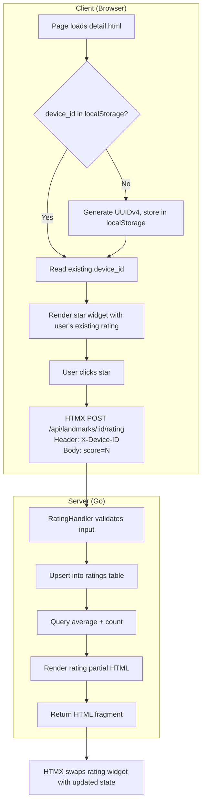

# Design Document: Landmark Rating System

## Overview

This feature adds a 1–5 star rating system to landmark detail pages. Device identification uses a client-side UUID in localStorage — no login required. Ratings are persisted in SQLite. The star widget uses Alpine.js for hover interactivity and HTMX for server communication.

### Key Design Decisions

1. **localStorage UUID over real fingerprinting**: Simple, privacy-friendly, sufficient for a demo app. Users can circumvent it by clearing storage, which is acceptable for this use case.
2. **HTMX partial responses**: After rating submission, the server returns an HTML fragment that HTMX swaps in — no full page reload needed.
3. **Server-side average calculation**: The average and count are computed via SQL on each request. No caching needed at demo scale.
4. **Upsert semantics**: Uses `INSERT ... ON CONFLICT ... UPDATE` to handle both new ratings and updates in a single query.

## Architecture



### Request Flow

1. **Page load**: Detail handler queries the rating summary (avg, count) and the device's own rating (if `X-Device-ID` header present). Data passed to template.
2. **Rating submission**: HTMX POSTs to `/api/landmarks/{id}/rating` with `X-Device-ID` header and `score` form value. Server upserts and returns updated widget HTML.

## Components and Interfaces

### 1. Database Schema — `ratings` table

```sql
CREATE TABLE IF NOT EXISTS ratings (
    id          INTEGER PRIMARY KEY AUTOINCREMENT,
    landmark_id INTEGER NOT NULL,
    device_id   TEXT NOT NULL,
    score       INTEGER NOT NULL CHECK(score >= 1 AND score <= 5),
    created_at  TEXT NOT NULL DEFAULT (datetime('now')),
    updated_at  TEXT NOT NULL DEFAULT (datetime('now')),
    FOREIGN KEY (landmark_id) REFERENCES landmarks(id),
    UNIQUE(landmark_id, device_id)
);
```

### 2. Store Layer — `internal/store/ratings.go`

```go
// RatingSummary holds the aggregate rating data for a landmark.
type RatingSummary struct {
    Average  float64
    Count    int
    UserScore int // 0 means no rating from this device
}

// GetRatingSummary returns avg, count, and the device's own score for a landmark.
func (s *Store) GetRatingSummary(landmarkID int64, deviceID string) (*RatingSummary, error)

// UpsertRating creates or updates a rating for a device+landmark pair.
func (s *Store) UpsertRating(landmarkID int64, deviceID string, score int) error
```

**SQL for GetRatingSummary** (two queries or a single query with subselect):
```sql
SELECT
    COALESCE(AVG(score), 0) as average,
    COUNT(*) as count,
    COALESCE((SELECT score FROM ratings WHERE landmark_id = ? AND device_id = ?), 0) as user_score
FROM ratings
WHERE landmark_id = ?;
```

**SQL for UpsertRating**:
```sql
INSERT INTO ratings (landmark_id, device_id, score)
VALUES (?, ?, ?)
ON CONFLICT(landmark_id, device_id)
DO UPDATE SET score = excluded.score, updated_at = datetime('now');
```

### 3. HTTP Handler — `internal/handler/rating.go`

New handler registered on the chi router:

```go
// POST /api/landmarks/{id}/rating
func (h *Handler) SubmitRating(w http.ResponseWriter, r *http.Request)
```

**Logic**:
1. Parse landmark ID from URL param
2. Read `X-Device-ID` header — return 400 if missing
3. Parse `score` from form body — return 400 if invalid (not 1–5)
4. Call `store.UpsertRating(landmarkID, deviceID, score)`
5. Call `store.GetRatingSummary(landmarkID, deviceID)`
6. Render `rating_widget.html` partial template and write response

### 4. Detail Page Integration

The detail handler is extended to:
- Read `X-Device-ID` from header (optional on page load — could also be sent via HTMX on initial load)
- Query `GetRatingSummary` for the landmark
- Pass rating data to the template

**PageData extension**:
```go
type PageData struct {
    // ... existing fields
    Rating *RatingSummary // nil if rating feature not applicable
}
```

### 5. Star Widget Template — `templates/partials/rating_widget.html`

An Alpine.js component that:
- Manages hover state (`hoverScore`) and current submitted score (`userScore`)
- Renders 5 SVG star icons (Lucide `star` icon), filled/highlighted based on state
- On click, triggers HTMX POST with the selected score
- Displays average rating (numeric) and count
- Includes full dark mode support via `dark:` Tailwind variants

```html
<div id="rating-widget"
     x-data="{ hoverScore: 0, userScore: {{.Rating.UserScore}} }"
     class="flex items-center gap-4">
    <!-- Stars (using Lucide star icon) -->
    <div class="flex gap-1"
         @mouseleave="hoverScore = 0">
        {{range $i := seq 1 5}}
        <button
            @mouseenter="hoverScore = {{$i}}"
            @click="userScore = {{$i}}"
            hx-post="/api/landmarks/{{$.Landmark.ID}}/rating"
            hx-vals='{"score": "{{$i}}"}'
            hx-headers='js:{"X-Device-ID": localStorage.getItem("device_id")}'
            hx-target="#rating-widget"
            hx-swap="outerHTML"
            :class="(hoverScore >= {{$i}} || (!hoverScore && userScore >= {{$i}})) ? 'text-amber-400' : 'text-stone-300 dark:text-stone-500'"
            class="cursor-pointer transition-colors"
            aria-label="Rate {{$i}} stars">
            <!-- Lucide star icon -->
            <svg xmlns="http://www.w3.org/2000/svg" width="20" height="20" viewBox="0 0 24 24" fill="currentColor" stroke="currentColor" stroke-width="1" stroke-linecap="round" stroke-linejoin="round"><polygon points="12 2 15.09 8.26 22 9.27 17 14.14 18.18 21.02 12 17.77 5.82 21.02 7 14.14 2 9.27 8.91 8.26 12 2"/></svg>
        </button>
        {{end}}
    </div>
    <!-- Summary -->
    <span class="text-sm text-stone-600 dark:text-stone-400">
        {{if gt .Rating.Count 0}}
            {{printf "%.1f" .Rating.Average}} ({{.Rating.Count}})
        {{else}}
            Noch keine Bewertungen
        {{end}}
    </span>
</div>
```

### 6. Client-Side Device ID Initialization

In `base.html` (or a small inline script), ensure `device_id` exists:

```html
<script>
  if (!localStorage.getItem('device_id')) {
    localStorage.setItem('device_id', crypto.randomUUID());
  }
</script>
```

This runs on every page load but only writes once.

### 7. Router Registration

In `cmd/server/main.go` (or wherever routes are defined):

```go
r.Post("/api/landmarks/{id}/rating", h.SubmitRating)
```

## File Changes Summary

| File | Change |
|------|--------|
| `internal/store/migrations.go` | Add ratings table migration |
| `internal/store/ratings.go` | New file: `GetRatingSummary`, `UpsertRating` |
| `internal/handler/rating.go` | New file: `SubmitRating` handler |
| `internal/handler/handler.go` | Extend `PageData` with Rating field |
| `internal/handler/detail.go` | Query rating data, pass to template |
| `templates/partials/rating_widget.html` | New partial: star widget |
| `templates/detail.html` | Include rating widget partial |
| `templates/base.html` | Add device_id initialization script |
| `cmd/server/main.go` | Register POST route |
| `internal/handler/template_funcs.go` | Add `seq` helper function |
