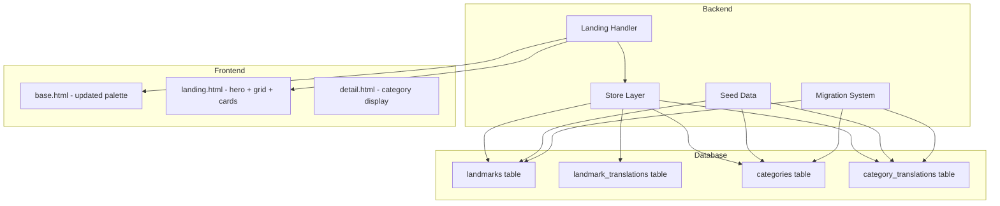
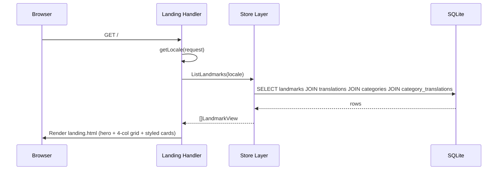
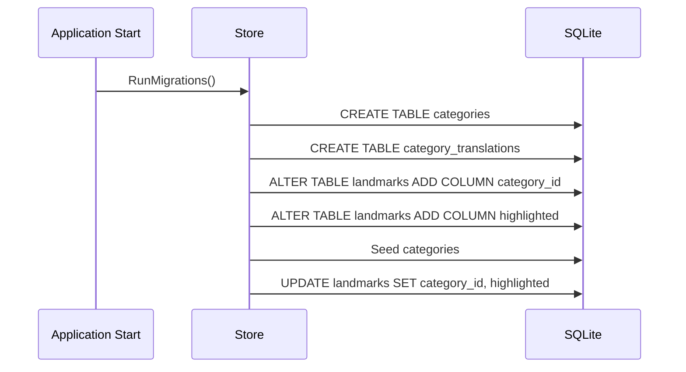

# Design Document: UX Refinement

## Overview

This feature transforms the Heidelguide landing page from a minimal, muted design into a playful, colorful experience that better reflects Heidelberg's vibrant character. The changes span the full stack: a new category system with translations in the database, a `highlighted` flag for featured landmarks, a scenic hero header image, redesigned landmark cards with category pills and highlight badges, a warmer color palette, and a 4-column desktop grid layout.

The data model gains two new concepts — categories (with i18n support) and a highlight flag — while the frontend receives a visual overhaul using Tailwind CSS utilities. The backend changes are additive (new tables, new columns, updated queries) with a migration path that preserves existing data.

## Architecture



## Sequence Diagrams

### Landing Page Load



### Data Migration Flow



## Components and Interfaces

### Component 1: Category Data Model

**Purpose**: Introduce a category system with i18n support for classifying landmarks.

**Interface**:
```go
// Category represents a landmark classification (e.g., Architecture, Nature).
type Category struct {
    ID    int64
    Slug  string // machine-readable identifier: "architecture", "nature", "history", "culture"
    Color string // Tailwind color class for the pill: "rose", "emerald", "amber", "violet"
}

// CategoryTranslation holds locale-specific name for a category.
type CategoryTranslation struct {
    ID         int64
    CategoryID int64
    Locale     string
    Name       string // e.g., "ARCHITEKTUR", "ARCHITECTURE"
}
```

**Responsibilities**:
- Store category metadata (slug, color mapping)
- Provide translated category names per locale
- Map each landmark to exactly one category

### Component 2: Extended Landmark Model

**Purpose**: Extend the landmark with category association and highlight flag.

**Interface**:
```go
// Landmark (extended) — adds category and highlight fields.
type Landmark struct {
    ID            int64
    Latitude      float64
    Longitude     float64
    ImageFilename string
    YearBuilt     int
    YearDestroyed *int
    CategoryID    int64 // FK to categories table
    Highlighted   bool  // true = show "Highlight" badge on card
}

// LandmarkView is the full view used by templates (replaces LandmarkWithTranslation).
type LandmarkView struct {
    Landmark
    LandmarkTranslation
    CategoryName  string // translated category name for current locale
    CategorySlug  string // for color mapping
    CategoryColor string // Tailwind color token
}
```

**Responsibilities**:
- Carry all data needed to render a landmark card in a single struct
- Include category display info (translated name + color)
- Include highlight status

### Component 3: Updated Store Layer

**Purpose**: Extend queries to join category data and filter highlighted landmarks.

**Interface**:
```go
// ListLandmarks returns all landmarks with translations and category info.
func (s *Store) ListLandmarks(locale string) ([]model.LandmarkView, error)

// GetLandmark returns a single landmark with full view data.
func (s *Store) GetLandmark(id int64, locale string) (*model.LandmarkView, error)
```

**Responsibilities**:
- Join landmarks with categories and category_translations
- Return LandmarkView structs with all display data pre-resolved
- Maintain backward compatibility (same function signatures, richer return type)

### Component 4: Updated Landing Template

**Purpose**: Render the new visual design — hero image, 4-column grid, styled cards.

**Responsibilities**:
- Display full-width scenic hero image with overlay text
- Render landmark cards in a 4-column grid (desktop), 2-column (tablet), 1-column (mobile)
- Show category pill with color coding on each card
- Show "Highlight" badge on featured landmarks
- Display "Mehr erfahren →" / "Learn more →" link at card bottom
- Show "HG" monogram placeholder when image is loading

### Component 5: Updated Detail Template

**Purpose**: Apply the same playful/colorful overhaul to the landmark detail page, add breadcrumb navigation.

**Responsibilities**:
- Display category pill on the detail page (same color coding as cards)
- Show "Highlight" badge if the landmark is highlighted
- Add a breadcrumb bar below the nav: "Home > Landmark Name" (only "Home" is clickable)
- Keep the top navigation bar visible (no hiding/collapsing on detail page)
- Apply the warmer color palette consistently with the landing page
- Maintain the existing content sections (description, history, metadata)

### Component 6: Color Palette Update

**Purpose**: Shift from muted amber/stone to a warmer, more vibrant palette.

**Responsibilities**:
- Update base template body/nav colors
- Define category-specific colors (rose, emerald, amber, violet)
- Keep historic Heidelberg feel while being more playful
- Maintain light-mode only

## Data Models

### New Table: categories

```sql
CREATE TABLE IF NOT EXISTS categories (
    id    INTEGER PRIMARY KEY AUTOINCREMENT,
    slug  TEXT NOT NULL UNIQUE,
    color TEXT NOT NULL
);
```

**Seed Data**:
| id | slug         | color    |
|----|--------------|----------|
| 1  | architecture | rose     |
| 2  | nature       | emerald  |
| 3  | history      | amber    |
| 4  | culture      | violet   |

### New Table: category_translations

```sql
CREATE TABLE IF NOT EXISTS category_translations (
    id          INTEGER PRIMARY KEY AUTOINCREMENT,
    category_id INTEGER NOT NULL,
    locale      TEXT NOT NULL,
    name        TEXT NOT NULL,
    FOREIGN KEY (category_id) REFERENCES categories(id),
    UNIQUE(category_id, locale)
);
```

**Seed Data**:
| category_id | locale | name          |
|-------------|--------|---------------|
| 1           | de     | ARCHITEKTUR   |
| 1           | en     | ARCHITECTURE  |
| 2           | de     | NATUR         |
| 2           | en     | NATURE        |
| 3           | de     | GESCHICHTE    |
| 3           | en     | HISTORY       |
| 4           | de     | KULTUR        |
| 4           | en     | CULTURE       |

### Altered Table: landmarks (new columns)

```sql
ALTER TABLE landmarks ADD COLUMN category_id INTEGER REFERENCES categories(id) DEFAULT 1;
ALTER TABLE landmarks ADD COLUMN highlighted INTEGER NOT NULL DEFAULT 0;
```

**Category Assignments** (existing landmarks):
| Landmark               | Category     | Highlighted |
|------------------------|--------------|-------------|
| Heidelberger Schloss   | architecture | true        |
| Alte Brücke            | architecture | true        |
| Philosophenweg         | nature       | false       |
| Heiliggeistkirche      | architecture | false       |
| Studentenkarzer        | history      | true        |
| Universitätsbibliothek | culture      | false       |
| Königstuhl             | nature       | false       |
| Neckarwiese            | nature       | false       |

**Validation Rules**:
- `category_id` must reference a valid category
- `highlighted` is 0 or 1 (SQLite boolean)
- Every category must have translations for all supported locales (de, en)

## Algorithmic Pseudocode

### Migration Execution

```go
// New migrations appended to the existing migrations slice.
// The migration system runs them in order, skipping already-applied ones.

var newMigrations = []string{
    `CREATE TABLE IF NOT EXISTS categories (
        id    INTEGER PRIMARY KEY AUTOINCREMENT,
        slug  TEXT NOT NULL UNIQUE,
        color TEXT NOT NULL
    )`,
    `CREATE TABLE IF NOT EXISTS category_translations (
        id          INTEGER PRIMARY KEY AUTOINCREMENT,
        category_id INTEGER NOT NULL,
        locale      TEXT NOT NULL,
        name        TEXT NOT NULL,
        FOREIGN KEY (category_id) REFERENCES categories(id),
        UNIQUE(category_id, locale)
    )`,
    `ALTER TABLE landmarks ADD COLUMN category_id INTEGER REFERENCES categories(id) DEFAULT 1`,
    `ALTER TABLE landmarks ADD COLUMN highlighted INTEGER NOT NULL DEFAULT 0`,
}
```

### Updated ListLandmarks Query

```go
func (s *Store) ListLandmarks(locale string) ([]model.LandmarkView, error) {
    rows, err := s.db.Query(`
        SELECT l.id, l.latitude, l.longitude, l.image_filename, l.year_built, l.year_destroyed,
               l.category_id, l.highlighted,
               t.id, t.landmark_id, t.locale, t.name, t.description, t.history,
               c.slug, c.color,
               COALESCE(ct.name, c.slug) as category_name
        FROM landmarks l
        JOIN landmark_translations t ON l.id = t.landmark_id AND t.locale = ?
        LEFT JOIN categories c ON l.category_id = c.id
        LEFT JOIN category_translations ct ON c.id = ct.category_id AND ct.locale = ?
        ORDER BY l.highlighted DESC, l.id ASC`,
        locale, locale)
    // ...scan into []model.LandmarkView
}
```

**Preconditions:**
- `locale` is a valid supported locale ("de" or "en")
- Database migrations have been applied (categories table exists)

**Postconditions:**
- Returns landmarks ordered by highlighted first, then by ID
- Each LandmarkView has resolved category name and color
- Landmarks without a category get a default fallback

### Seed Categories Function

```go
func (s *Store) SeedCategories() error {
    var count int
    err := s.db.QueryRow("SELECT COUNT(*) FROM categories").Scan(&count)
    if err != nil {
        return err
    }
    if count > 0 {
        return nil // already seeded
    }

    categories := []struct {
        Slug  string
        Color string
        Names map[string]string // locale -> name
    }{
        {"architecture", "rose", map[string]string{"de": "ARCHITEKTUR", "en": "ARCHITECTURE"}},
        {"nature", "emerald", map[string]string{"de": "NATUR", "en": "NATURE"}},
        {"history", "amber", map[string]string{"de": "GESCHICHTE", "en": "HISTORY"}},
        {"culture", "violet", map[string]string{"de": "KULTUR", "en": "CULTURE"}},
    }

    tx, err := s.db.Begin()
    if err != nil {
        return err
    }
    defer tx.Rollback()

    for _, cat := range categories {
        result, err := tx.Exec(
            "INSERT INTO categories (slug, color) VALUES (?, ?)",
            cat.Slug, cat.Color)
        if err != nil {
            return err
        }
        catID, _ := result.LastInsertId()
        for locale, name := range cat.Names {
            _, err = tx.Exec(
                "INSERT INTO category_translations (category_id, locale, name) VALUES (?, ?, ?)",
                catID, locale, name)
            if err != nil {
                return err
            }
        }
    }

    return tx.Commit()
}
```

**Preconditions:**
- categories table exists (migrations applied)
- Function is idempotent (checks count before inserting)

**Postconditions:**
- 4 categories exist with translations for de and en
- No duplicate entries created on repeated calls

### Assign Categories to Existing Landmarks

```go
func (s *Store) AssignDefaultCategories() error {
    // Map landmark IDs to category slugs and highlight status
    assignments := []struct {
        LandmarkID  int64
        CategorySlug string
        Highlighted  bool
    }{
        {1, "architecture", true},  // Heidelberger Schloss
        {2, "architecture", true},  // Alte Brücke
        {3, "nature", false},       // Philosophenweg
        {4, "architecture", false}, // Heiliggeistkirche
        {5, "history", true},       // Studentenkarzer
        {6, "culture", false},      // Universitätsbibliothek
        {7, "nature", false},       // Königstuhl
        {8, "nature", false},       // Neckarwiese
    }

    for _, a := range assignments {
        _, err := s.db.Exec(`
            UPDATE landmarks
            SET category_id = (SELECT id FROM categories WHERE slug = ?),
                highlighted = ?
            WHERE id = ?`,
            a.CategorySlug, boolToInt(a.Highlighted), a.LandmarkID)
        if err != nil {
            return err
        }
    }
    return nil
}

func boolToInt(b bool) int {
    if b {
        return 1
    }
    return 0
}
```

## Key Functions with Formal Specifications

### Function: ListLandmarks (updated)

```go
func (s *Store) ListLandmarks(locale string) ([]model.LandmarkView, error)
```

**Preconditions:**
- `locale` ∈ {"de", "en"}
- Database connection is open and healthy
- All migrations have been applied

**Postconditions:**
- Returns all landmarks with their translated content and category info
- Highlighted landmarks appear first in the result set
- Each LandmarkView.CategoryName is in the requested locale
- Each LandmarkView.CategoryColor is a valid Tailwind color token
- If a landmark has no category, CategoryName defaults to the slug

**Loop Invariants:** N/A (single query, no iteration logic)

### Function: SeedCategories

```go
func (s *Store) SeedCategories() error
```

**Preconditions:**
- categories table exists
- category_translations table exists

**Postconditions:**
- If categories were already seeded: no changes, returns nil
- If categories were empty: exactly 4 categories inserted with 2 translations each
- Total rows after: 4 in categories, 8 in category_translations

### Function: GetLandmark (updated)

```go
func (s *Store) GetLandmark(id int64, locale string) (*model.LandmarkView, error)
```

**Preconditions:**
- `id` > 0
- `locale` ∈ {"de", "en"}
- Database connection is open and healthy

**Postconditions:**
- Returns a single LandmarkView with category info and highlight status
- Returns nil if landmark not found (not an error)
- CategoryName is in the requested locale
- CategoryColor is a valid Tailwind color token

### Function: categoryColorClass (template helper)

```go
func categoryColorClass(color string) string
```

**Preconditions:**
- `color` is one of: "rose", "emerald", "amber", "violet"

**Postconditions:**
- Returns a Tailwind CSS class string for the pill background and text
- Mapping: rose → "bg-rose-100 text-rose-700", emerald → "bg-emerald-100 text-emerald-700", etc.

## Example Usage

### Template: Landmark Card (landing.html)

```html
{{range .Landmarks}}
<a href="/landmarks/{{.Landmark.ID}}" class="group block bg-white rounded-2xl shadow-sm hover:shadow-lg transition-all overflow-hidden border border-stone-200/60">
    <!-- Highlight Badge -->
    {{if .Highlighted}}
    <div class="absolute top-3 left-3 z-10">
        <span class="px-2 py-1 text-xs font-bold rounded-full bg-amber-400 text-amber-900">
            Highlight
        </span>
    </div>
    {{end}}

    <!-- Image with HG monogram fallback -->
    <div class="relative aspect-video overflow-hidden bg-stone-100">
        <div class="absolute inset-0 flex items-center justify-center text-stone-300 text-4xl font-bold">HG</div>
        
    </div>

    <!-- Card Body -->
    <div class="p-5">
        <!-- Category Pill -->
        <span class="inline-block px-2 py-0.5 text-xs font-semibold rounded-full mb-2 {{categoryColorClass .CategoryColor}}">
            {{.CategoryName}}
        </span>

        <h2 class="font-serif-accent text-lg font-semibold text-stone-800 group-hover:text-amber-700 transition-colors mb-2">
            {{.Name}}
        </h2>

        <p class="text-stone-600 text-sm leading-relaxed mb-4 line-clamp-2">
            {{.Description}}
        </p>

        <span class="text-amber-600 text-sm font-medium group-hover:text-amber-800 transition-colors">
            {{if eq $.Locale "de"}}Mehr erfahren →{{else}}Learn more →{{end}}
        </span>
    </div>
</a>
{{end}}
```

### Template: Hero Section (landing.html)

```html
<section class="relative h-64 md:h-80 overflow-hidden">
    
    <div class="absolute inset-0 bg-gradient-to-t from-stone-900/70 to-transparent"></div>
    <div class="absolute bottom-0 left-0 right-0 p-8 max-w-7xl mx-auto">
        <h1 class="font-serif-accent text-3xl md:text-5xl font-bold text-white mb-2">
            {{if eq .Locale "de"}}Entdecke Heidelberg{{else}}Discover Heidelberg{{end}}
        </h1>
        <p class="text-amber-100 text-lg max-w-2xl">
            {{if eq .Locale "de"}}Erkunde die schönsten Sehenswürdigkeiten der Stadt am Neckar{{else}}Explore the most beautiful landmarks of the city on the Neckar{{end}}
        </p>
    </div>
</section>
```

### Template: Detail Page Breadcrumb + Category (detail.html)

```html
<!-- Breadcrumb Bar -->
<div class="max-w-7xl mx-auto px-4 py-3">
    <nav class="flex items-center text-sm text-stone-500">
        <a href="/" class="text-amber-700 hover:text-amber-900 font-medium transition-colors">
            {{if eq .Locale "de"}}Startseite{{else}}Home{{end}}
        </a>
        <svg xmlns="http://www.w3.org/2000/svg" class="h-4 w-4 mx-2 text-stone-400" fill="none" viewBox="0 0 24 24" stroke="currentColor" stroke-width="2">
            <path stroke-linecap="round" stroke-linejoin="round" d="M9 5l7 7-7 7" />
        </svg>
        <span class="text-stone-700 font-medium">{{.Landmark.Name}}</span>
    </nav>
</div>

<!-- Category + Highlight on Detail Page -->
<div class="max-w-4xl mx-auto px-4 pt-4">
    <div class="flex items-center gap-2 mb-4">
        <span class="inline-block px-2 py-0.5 text-xs font-semibold rounded-full {{categoryColorClass .Landmark.CategoryColor}}">
            {{.Landmark.CategoryName}}
        </span>
        {{if .Landmark.Highlighted}}
        <span class="px-2 py-0.5 text-xs font-bold rounded-full bg-amber-400 text-amber-900">
            Highlight
        </span>
        {{end}}
    </div>
</div>
```

### Go: Template Function Map

```go
// In handler setup, register template functions
funcMap := template.FuncMap{
    "categoryColorClass": func(color string) string {
        colors := map[string]string{
            "rose":    "bg-rose-100 text-rose-700",
            "emerald": "bg-emerald-100 text-emerald-700",
            "amber":   "bg-amber-100 text-amber-700",
            "violet":  "bg-violet-100 text-violet-700",
        }
        if cls, ok := colors[color]; ok {
            return cls
        }
        return "bg-stone-100 text-stone-700"
    },
}
```

## Correctness Properties

1. **Category completeness**: Every landmark has exactly one category assigned (`category_id IS NOT NULL` after migration + seed).
2. **Translation completeness**: Every category has translations for all supported locales. `∀ category c, ∀ locale l ∈ {de, en}: ∃ category_translation(c.id, l)`.
3. **Color mapping validity**: Every `CategoryColor` in a `LandmarkView` maps to a known Tailwind class. No unknown colors reach the template.
4. **Highlight ordering**: In the returned landmark list, all highlighted landmarks appear before non-highlighted ones.
5. **Idempotent seeding**: Running `SeedCategories()` and `AssignDefaultCategories()` multiple times produces the same database state as running them once.
6. **Grid responsiveness**: The grid renders 1 column on mobile (<768px), 2 columns on tablet (768-1023px), and 4 columns on desktop (≥1024px).
7. **Hero image graceful degradation**: If the hero image fails to load, the gradient overlay still provides readable text contrast.
8. **Backward compatibility**: Existing landmark URLs (`/landmarks/{id}`) continue to work unchanged.
9. **Breadcrumb correctness**: On the detail page, the breadcrumb shows "Home > {Landmark Name}" where only "Home" links to `/`.
10. **Detail page category display**: The detail page shows the same category pill (color + translated name) as the landing page card for that landmark.
11. **Navigation persistence**: The top navigation bar is visible on both landing and detail pages without any scroll-based hiding.

## Error Handling

### Error Scenario 1: Missing Hero Image

**Condition**: `hero-heidelberg.jpg` not found in static/img/
**Response**: The `` tag fails silently; the gradient overlay still renders, text remains readable against the dark gradient.
**Recovery**: No runtime recovery needed — this is a build/deploy concern. The image must be included in the static assets.

### Error Scenario 2: Category Not Found for Landmark

**Condition**: A landmark's `category_id` references a deleted or non-existent category.
**Response**: The LEFT JOIN returns NULL; `COALESCE(ct.name, c.slug)` falls back to slug; if slug is also NULL, template shows empty pill.
**Recovery**: The `categoryColorClass` function returns a neutral stone color for unknown values.

### Error Scenario 3: Migration Fails on Existing Database

**Condition**: `ALTER TABLE` fails because column already exists (re-run scenario).
**Response**: SQLite returns an error for duplicate column addition.
**Recovery**: Use `IF NOT EXISTS` pattern or check column existence before altering. The migration system should track applied migrations.

## Testing Strategy

### Unit Testing Approach

- Test `categoryColorClass` function with all valid colors and an unknown color
- Test `SeedCategories` idempotency (call twice, verify same state)
- Test `ListLandmarks` returns `LandmarkView` structs with category data populated
- Test highlight ordering in query results
- Test `boolToInt` helper

### Property-Based Testing Approach

**Property Test Library**: Go standard `testing` with table-driven tests (no external PBT library needed for this scope)

- Property: For any locale in supported set, `ListLandmarks` returns the same number of landmarks
- Property: All returned `CategoryColor` values are in the valid set {"rose", "emerald", "amber", "violet"}
- Property: Highlighted landmarks always precede non-highlighted in results

### Visual Regression Testing (Playwright)

Per workspace rules, use Playwright for visual checks:
- Verify hero image section renders with correct dimensions
- Verify 4-column grid on desktop viewport
- Verify category pills are visible on cards
- Verify highlight badges appear on expected cards
- Verify "Mehr erfahren →" link text on cards
- Verify detail page breadcrumb shows "Home > Landmark Name"
- Verify detail page displays category pill and highlight badge
- Verify top navigation is visible on detail page

## Performance Considerations

- The updated `ListLandmarks` query adds two JOINs (categories + category_translations). With 8 landmarks and 4 categories, this is negligible.
- The hero image should be optimized (compressed JPEG, ~200KB max) to avoid slow page loads.
- No additional database indexes needed at this scale.

## Security Considerations

- No user input is involved in category/highlight data — all values are seeded by the application.
- Template rendering uses Go's `html/template` which auto-escapes, preventing XSS.
- No new endpoints or attack surface introduced.

## Dependencies

- **No new Go dependencies** — uses standard library only
- **Hero image**: A scenic photograph of Heidelberg city centre (to be added to `static/img/`)
- **Tailwind CSS**: Already included; the new color classes (rose, emerald, violet) are part of the default Tailwind palette in the existing `tailwind.min.css`

## I18n Labels (additions to internal/i18n/i18n.go)

New label keys needed:

| Key          | DE               | EN             |
|--------------|------------------|----------------|
| learn_more   | Mehr erfahren    | Learn more     |
| home         | Startseite       | Home           |
| highlight    | Highlight        | Highlight      |
